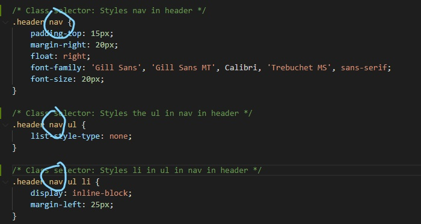

# Code Refactor Starter Code
For this assignment, I made this website follow accessibility standards that it is optimitized for search engines.

I updated the name of the title to the name of the company "Horiseon"

I added header, nav, section, aside, and footer semantic elements in place of the div element so it is easier for the search engine and more accessible.

I changed div class="header" to just header and div class="footer" to just footer

This lead to some changes in the style.css file:
-The header div, header div ul, and header div ul li CSS selectors to header nav, header nav ul, and header nav ul li in the style.css file so the styles would remain.

-I removed the period in front of the .header class selectors in the style.css file so that they would become header element selector

-I removed the period in front of the .footer class selectors in the style.css file so that they would become footer element selector

I added the id element in the Search Engine Optimization article.  This allows the link to work when you click the Search Engine Optimization tab in the nav to the Search Engine Optimization article. 

I added alt attributes to the images in the content section with descriptions of each image.  I added alt="" to the decorative images in the benefits aside.

I edited the order of the CSS selectors in the style.css file so that the selectors would be the sequence they appear in the index.html file

I added comments to the CSS and the HTML files.

I upload changes frequently to Github repository with commit messages.

Below is the final image

